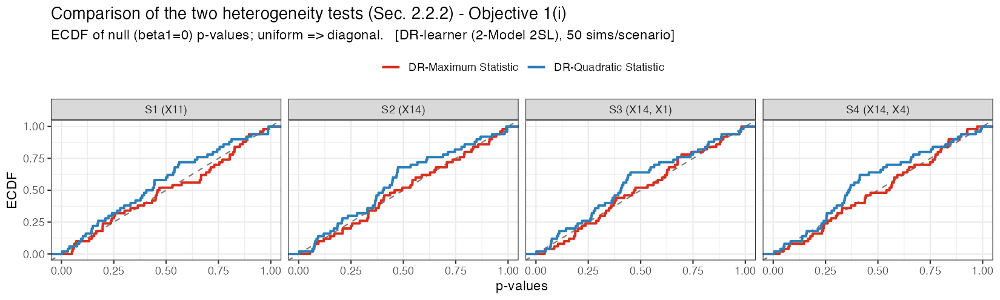
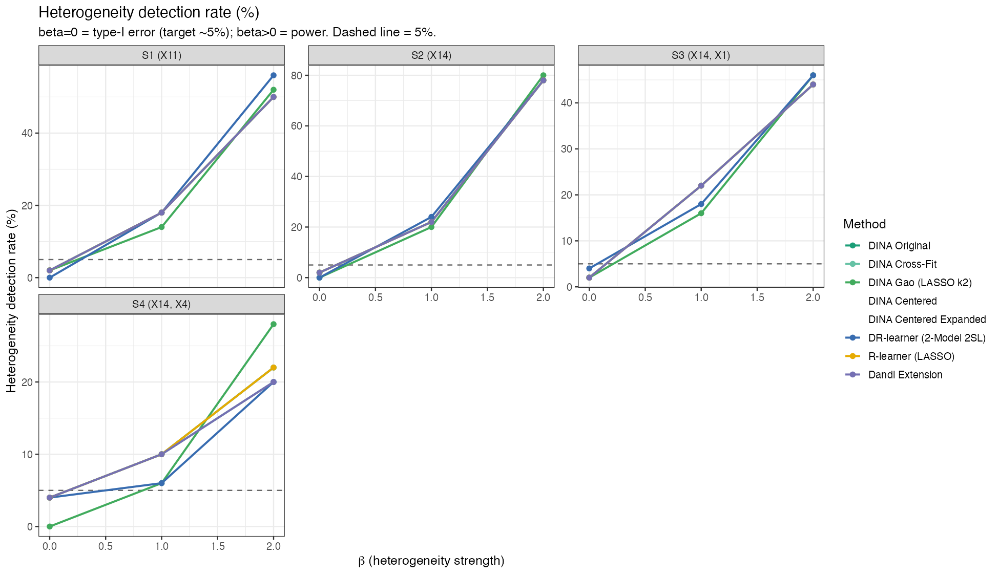
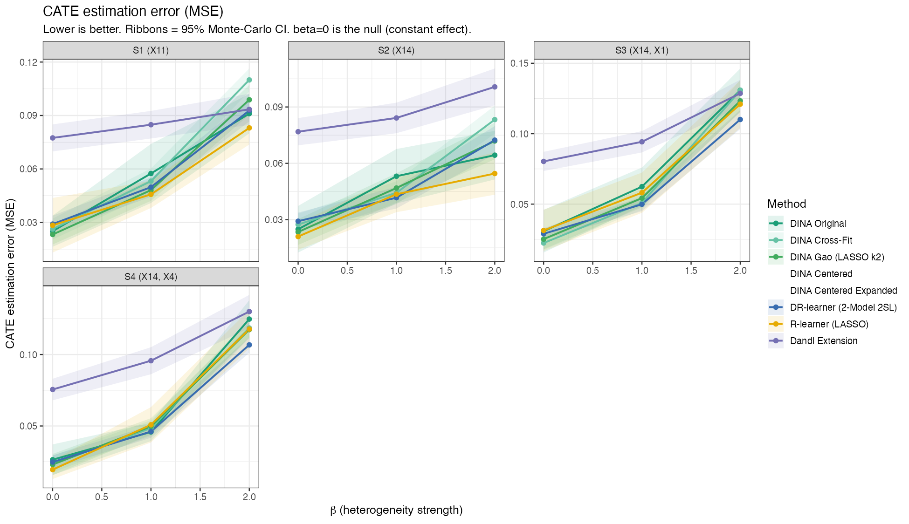
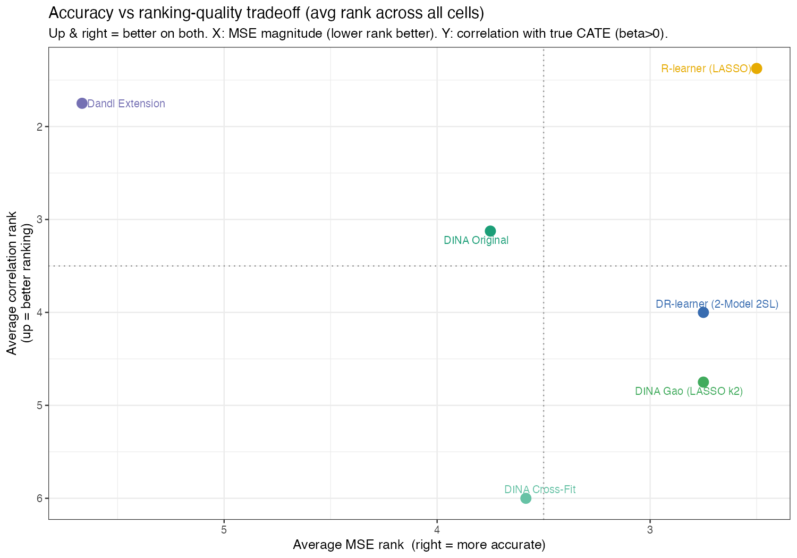

# Comparing Meta-Learners for Treatment Effect Heterogeneity — the Three WATCH Objectives

A Monte-Carlo simulation pipeline in **R** that benchmarks 13 meta-learners for
**heterogeneous treatment effect (HTE)** analysis, evaluated on the three
objectives of the **WATCH workflow** (Workflow to Assess Treatment effeCt
Heterogeneity; Sechidis et al., [arXiv:2502.00713](https://arxiv.org/abs/2502.00713)):

| | Objective | What is measured here |
|---|---|---|
| **1** | **Global test for heterogeneity** — is there evidence against a homogeneous treatment effect? | Type-I error at β=0 and power at β>0 of a permutation independence test (max-type and quadratic-type statistics) applied to each method's pseudo-outcome |
| **2** | **Effect-modifier ranking** — which covariates drive the heterogeneity? | Probability that the top-ranked variable is a *true* effect modifier (vs. purely prognostic or noise), under the null and across signal strengths |
| **3** | **Individualized effect estimation** — how well is the CATE itself estimated? | MSE, bias, correlation and Somers' D between estimated and true individual effects, plus the Gao (2024) doubly-robust pairwise relative-error test on held-out data |

## The "same footing" design

The methodological core of this pipeline (`R/meta_learners.R`): when each
meta-learner fits its own stage-1 nuisance models, *"which estimator is
better"* is confounded with *"which got better nuisances"*. Here **one unified
stage-1 estimator** produces cross-fitted nuisances — 5-fold cross-fitting
stratified on the outcome, `SuperLearner(glmnet + cforest)` outcome models,
`SuperLearner(glmnet)` propensity (estimated even in an RCT) — and **every
learner consumes those same nuisances** for its second stage. Methods
therefore differ in the their Phsedo outcome aas well as stage-2 CATE regression.

The single exception is the pair of faithful Gao & Hastie (2022) replicas
("DINA Gao k2"),they run a self-contained 2-fold (each for stage 1 and one for stage 2 then intechange) with the *same*
SuperLearner library for .

## Methods compared

| Method | Stage-2 idea | Reference |
|---|---|---|
| DR-learner (2-Model 2SL) — *reference* | Per-fold SuperLearner regression(train) of the AIPW pseudo-outcome, estimate ITE and averaged over all data; over folds | Sechidis et al. (2025) |
| DR-learner (Kennedy) | Cross-fit SuperLearner regression of the AIPW pseudo-outcome | Kennedy (2023) |
| DINA Original | Single full-sample LASSO on the residualized interaction design (kept as the documented sample-splitting contrast) | Gao & Hastie (2022) |
| DINA Cross-Fit | Leakage-free DML1: per-fold LASSO, coefficients averaged over the K shared folds | Gao & Hastie (2022) |
| DINA Gao (GLM k2) | Faithful Algorithm-1 replica, *unpenalized* OLS stage 2 (self-contained k=2) | Gao & Hastie (2022) §4.2 |
| DINA Gao (LASSO k2) | Same, with L1-penalized stage 2 | Gao & Hastie (2022), footnote |
| DINA Centered | Center+scaled interaction design with a free intercept — decouples the ATE column from modifier selection | this project |
| DINA Centered Expanded | Adds quartile-threshold indicators for continuous covariates (targets subgroup-type CATEs) | this project |
| R-learner (LASSO) | `rlearner::rlasso` on the shared nuisances | Nie & Wager (2021) |
| Dandl Extension | Model-based forest (`model4you::pmforest`) on the residualized base model | Dandl et al. (2024) |
| WATCH (Residual LASSO) | Score-residual heterogeneity test on a LASSO prognostic risk score | Sechidis et al. WATCH workflow |
| WATCH (Residual Risk) | Same, with a ridge risk score | Sechidis et al. WATCH workflow |
| TMLE (Li 2026 VTE) | CATE-targeted TMLE for the *variance of the treatment effect*, CI-based detection | Li et al. (2026) |

Two additional Objective-2 tools run alongside the learners:

* **TE-VIM TMLE** (`R/te_vim.R`) — a faithful port of
  [HaodongL/te_vim](https://github.com/HaodongL/te_vim) (Li et al. 2026)
  computing targeted estimates of Ψ₁ = VTE, Ψ₂ = VIMa and Ψ₃ = VIMb per
  covariate (leave-one-out), with influence-curve CIs. Four reviewed
  adaptations are documented inline as `[A1]–[A4]`.
* **Gao (2024) relative-error EIF** — a doubly-robust pairwise test of which
  CATE estimator is closer to the truth, evaluated on an independent sample
  (verified to match the official
  [Causal-validation-IF](https://github.com/ZijunGao/Causal-validation-IF) code).

## Simulation design

Scenarios 1–4 reproduce the **Sun et al. (2022) `benchtm` benchmark** exactly
(Biometrical Journal, [DOI 10.1002/bimj.202100337](https://doi.org/10.1002/bimj.202100337)):
synthetic-population covariates mimicking real Phase-III inflammatory-disease
trial data (n = 500, p = 30; 8 categorical + 22 numeric), an RCT treatment
assignment, and a continuous outcome with pre-calibrated effect sizes.

| Scenario | True effect modifier(s) | CATE shape |
|---|---|---|
| S1 | X11 | step (probit) in a numeric covariate |
| S2 | X14 | linear in a numeric covariate |
| S3 | X14, X1 | subgroup: `X14 > 0.25 & X1 == 'N'` |
| S4 | X14, X4 | subgroup: `X14 > 0.3 \| X4 == 'Y'` |

β ∈ {0, 1, 2} scales the heterogeneity: **β = 0** is the homogeneous null
(type-I error), **β = 1** is calibrated to ~80% interaction-test power,
**β = 2** is strong heterogeneity. Ground truth for Objective 2 is *derived
from the DGP itself* in `R/scenario_meta.R`.
<!--so the analysis can never drift out of sync with the simulation. -->

## Sample results

From a completed 50-simulations-per-setting run (figures regenerate with
`./scripts/run_analysis.sh`):

| | |
|---|---|
|  |  |
| *Objective 1(i): null p-values vs. the uniform diagonal (paper Fig. 2)* | *Objective 1(ii): detection rate by β (type-I error at β=0, power at β>0)* |
|  |  |
| *Objective 3: CATE estimation error across scenarios* | *Accuracy vs. ranking-quality tradeoff across all cells* |

## Repository structure

```
.
├── R/
│   ├── data_generation.R        # benchtm DGP (Sun et al. 2022 scenarios) + calibration
│   ├── meta_learners.R          # shared nuisances + all 13 learners + driver (+ §5 demo)
│   ├── te_vim.R                 # TE-VIM TMLE port (Li et al. 2026, Psi_1/2/3)
│   └── scenario_meta.R          # DGP-derived ground truth + shared analysis config
├── scripts/
│   ├── setup.sh                 # creates output dirs, checks dependencies
│   ├── run_parallel.sh          # simulation controller (workers in parallel)
│   ├── worker.R                 # one worker: generate data -> run all methods -> save .rds
│   ├── aggregate.R              # WATCH Objective 1/2/3 analysis -> results/
│   ├── analyze_focus_methods.R  # focused cross-scenario report -> results/focus_analysis/
│   ├── plot_paper_figures.R     # paper Figure 2/3 reproductions -> results/paper_figures/
│   └── run_analysis.sh          # runs the three analysis scripts in order
├── tests/
│   ├── verify_harness.R         # same-footing / cross-fit / EIF sanity checks
│   └── test_te_vim.R            # TE-VIM port vs. verbatim original (agreement < 1e-9)
├── data/
│   └── beta_star_RCT.rds        # beta* calibration (legacy scenarios 5-8 only)
└── results/                     # sample outputs from a completed run (regenerated on re-run)
```

## Installation

Requires **R ≥ 4.1**.

```r
# CRAN
install.packages(c(
  "dplyr", "tidyr", "ggplot2", "gridExtra", "viridis", "scales",
  "forcats", "ggrepel",
  "SuperLearner", "nnls", "caret", "glmnet",
  "party", "partykit", "model4you", "ranger",
  "coin", "permimp", "sandwich", "Hmisc"
))
# optional: install.packages("ggridges")

# GitHub
devtools::install_github("Sophie-Sun/benchtm")   # Sun et al. (2022) benchmark DGP — required
devtools::install_github("xnie/rlearner")        # R-learner (LASSO)
```

Then check everything at once:

```bash
./scripts/setup.sh
```

## Quick start

**Smoke-test demo** (single simulated dataset, all methods, ~minutes):

```bash
Rscript R/meta_learners.R
```

**Full simulation study** (all scenarios × β levels × 50 simulations; hours —
see the budget notes at the top of `scripts/run_parallel.sh`):

```bash
# edit N_CORES / N_SIMS_TOTAL / SCENARIOS / BETA_LEVELS / METHODS_TO_RUN first
caffeinate ./scripts/run_parallel.sh    # macOS; plain ./scripts/run_parallel.sh on Linux
```

The controller parallelizes `scripts/worker.R` over `N_CORES` workers
(intermediates in `temp/`, logs in `logs/`) and runs `scripts/aggregate.R`
automatically when finished. For the optional deep-dive reports:

```bash
./scripts/run_analysis.sh
```

All scripts are run **from the repo root**.

## Outputs (`results/`)

| File | Content |
|---|---|
| `final_summary_statistics.csv` | Per (scenario, β, method): MSE, bias, correlation, Somers' D, p-values, detection rates, runtime |
| `final_pairwise_relative_error.csv` | Gao (2024) EIF pairwise method comparisons with Monte-Carlo CIs and win rates |
| `final_vte_summary.csv` | Li (2026) VTE estimates and rejection rates |
| `WATCH_analysis_Scenario_*.pdf` | Per-scenario Objective 1/2/3 panels |
| `Cross_Scenario_Summary.pdf` | Power / MSE / overall rankings / timing across scenarios |
| `Performance_Distribution_*.pdf` | Density / violin / ridge views of the metric distributions |
| `focus_analysis/` | Focused report on the headline subset (14 panels + 2 PDFs + CSVs) |
| `paper_figures/` | Reproductions of Figures 2–3 of Sechidis et al. |

Note: `scripts/aggregate.R` analyses a configurable subset of methods by
default (`KEEP_METHODS` near the top of the file) — set it to `NULL` to
include every method that was run.

## Tests

```bash
Rscript tests/verify_harness.R   # shared-nuisance footing, DML1 fold usage, EIF sanity
Rscript tests/test_te_vim.R      # TE-VIM TMLE port vs. verbatim original implementation
```

## References

- Sechidis K., Zhang C., Sun S., Chen Y., Spector A., Bornkamp B. (2025).
  *Using Individualized Treatment Effects to Assess Treatment Effect
  Heterogeneity.* [arXiv:2502.00713](https://arxiv.org/abs/2502.00713) — the
  WATCH three objectives and the DR-learner workflow this project benchmarks.
- Sun S., Sechidis K., Chen Y., Lu J., Ma C., Mirshani A., Ohlssen D.,
  Vandemeulebroecke M., Bornkamp B. (2022). *Comparing algorithms for
  characterizing treatment effect heterogeneity in randomized trials.*
  Biometrical Journal. [`benchtm`](https://github.com/Sophie-Sun/benchtm) DGP.
- Kennedy E.H. (2023). *Towards optimal doubly robust estimation of
  heterogeneous causal effects.* Electronic Journal of Statistics.
- Gao Z., Hastie T. (2022). *Estimating heterogeneous treatment effects for
  general responses* (DINA). arXiv:2103.04277.
- Nie X., Wager S. (2021). *Quasi-oracle estimation of heterogeneous treatment
  effects.* Biometrika. [`rlearner`](https://github.com/xnie/rlearner).
- Dandl S., Bender A., Hothorn T. (2024). *Heterogeneous treatment effect
  estimation for observational data using model-based forests.* SMMR.
- Li H., Hubbard A., Hines O., Storås A., Kvist K., van der Laan M. (2026).
  *Targeted learning on variable importance measure for heterogeneous
  treatment effect.* [te_vim](https://github.com/HaodongL/te_vim).
- Gao Z. (2024). *Trustworthy assessment of heterogeneous treatment effect
  estimators.* [Causal-validation-IF](https://github.com/ZijunGao/Causal-validation-IF).

## License

[MIT](LICENSE)
